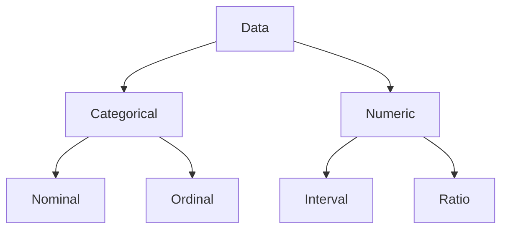

## Topics

- See [[pub/lessons/Unit 04 Special Topics/Levels of Measurement Nominal, Ordinal, Interval, and Ratio (with Examples)]]
- Data as measurement
- Measurement defined in terms of their scales (related to domain)
- Scales organized into levels
- NOIR 
	- Nominal
	- Ordinal 
	- Interval
	- Ratio
	
