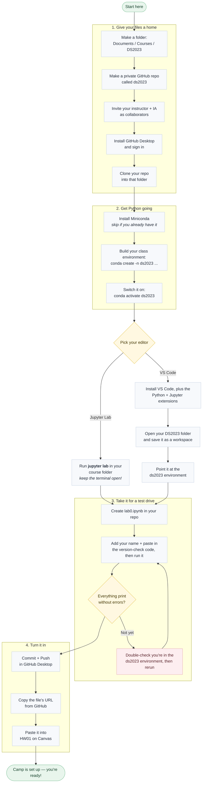

# Setting Up Your Coding Environment

DS 2023 | Communicating with Data

## Overiew

In this Lab, you will set up your coding environment so that you can do all the work required in this class. These instructions provide a high-level description of what you need to do; for each task, there are help docs that you can branch out to if you are unsure of what to do. 

> [!tip] You are encouraged to collaborate with your colleagues to get these things done.

## Requirements

**For your files:**

*It is essential for this class and all other data science courses that you have a place to put your code and a way to share it with others.* 

1. A private **GitHub** repository for your coursework. In general, when you submit homework, you will submit a URL to a notebook in your repo. To use GitHub, you will need to install a couple of other things, such as Git and SSH.
2. A **local directory** (aka folder) on your computer's file system in which you will clone this repo using Git, and where you will conduct all the work for this class.

**For your code:**

*Here is a list of all the software requirements for this class. This is often called your "stack."*

1. A working installation of **Python**, a popular programming language for data science. We will be using version $3.12$, which is not the latest one. You will define this in your environment (see next item).
2. A dedicated **Python environment** for this class with the right versions of Python and required modules. We recommend using `conda` for this, a command line tool that comes with Miniconda (see below).
3. A collection of Python **libraries** that you will use throughout the course, including Pandas, NumPy, Matplotlib, Seaborn, SciPy, and Plotly. Other libraries will be specified as needed.
4. **VS Code** or **Jupyter Lab**, two programming editors. If you use VS Code, you will need to install the extensions for Python and Jupyter. 
5. **Jupyter notebooks** will be the primary file format for this course. Although not a separate piece of software per se, it is worth highlighting this since these notebooks, which end in `.ipynb` are not standard Python files, which end in `.py`. 

>[!note] Although this seems like a lot of stuff, each task just requires following the steps, i.e. there's no problem solving -- just patience and attention to detail! If you are uncomfortable with the command line, then this will help you become acquainted with it. Also: you will use each of these things throughout your career as a student of data science at UVA.

## GitHub Instructions

### Create a Local Directory

Before doing anything, create a place on your computer where your course work will live, and where you will clone your course repo. It is strongly advised that you create a directory inside of your documents direcory ("Documents" on both Windows and Mac).

On Windows, this directory is here:

```cmd
C:\Users\[Username]\Documents
```

On a Mac, it's here:

```bash
/Users/[Username]/Documents
```

Of course, you need to replace `[Username]` with the user name you use to log onto your computer.

Under the Documents directory, you may want to create a directory called `Courses` where you can park all of your data science courses. Create a new directory in this directory called `DS2023`. In this directory you will put any files that are important for this class. You will also clone your course repo here.

### Set Up Your GitHub Account

Follow these steps if you don't already have an account:

1. Go to http://github.com/signup.
2. Follow the instructions to creating an account.

For more info on your account, check out the [account management page](https://docs.github.com/en/account-and-profile/how-tos/account-management/creating-an-account-on-github) as some point.

### Create Your Course Repo

Once you are logged into your account, follow these steps:

1. Click the **+** icon in the upper-right corner and select "New repository".
3. Choose the account that will own the project if you have more than one.
4. Type the name `ds2023` in the "Repository name" field. 
5. Scroll down and check the bubble for "Private" to ensure only you and invited collaborators can see it.
6. Also check the box to "Add a README file".
7. Also choose "Python" in the dropdown list by "Add .gitignore".
8. Don't worry about adding a license -- this is private repo.
9. Click the green "Create repository" button at the bottom of the page.

You now have a private repo!

### Share the Repo

Now, you need to share it with your instructor and IA. You can find their GitHub usernames on the Canvas site. To share, follow these steps:

1. Click on the "Settings" gear icon in the main menu of your repo.
2. Click on the "Collaborators" menu item on the left; it's the first item.
3. Click on the "Add people" button under "Manage access" and add the usernames.

Now, when you share a file's URL in this repo, the instructor and IA can see it.

### Install GitHub Desktop

In order to by-pass the complexity of installing Git from the command line, we will install GitHub Desktop, a graphical application that makes using Git and GitHub very easy. 

> [!tip] You may use the command line version of Git along with the desktop version if you wish. 

1. Open your web browser and navigate to [desktop.github.com](https://desktop.github.com/).
2. Click the central download button to download the application installer for your operating system (**MacOS** or **Windows**).
3. **Run the Installer:**
   * **For MacOS:** Open the downloaded `.dmg` file. It will asks you to move the the file to the Applicaitons directory -- select "Yes".
   * **For Windows:** Run the downloaded `.exe` installer. It will automatically install and launch the application on your computer.

### Sign Into GitHub

When you open GitHub Desktop for the first time, you will see a welcome screen:

1. Click the button that says **"Sign in to GitHub.com"**.
2. A window will open in your default web browser asking you to authorize the app.
3. Log into your GitHub account if prompted, and click the green **"Authorize desktop"** button.
4. Your browser will prompt you to open the application. Click **"Open GitHub Desktop"**.

### Configure Git Profiles

Once signed in, the app will ask you to configure your Git configuration profile:

1. Under **Name**, type your actual first and last name.
2. Under **Email**, make sure to select the exact email address linked to your primary GitHub account.
3. Click **Finish**.

### Clone Your Course Repository

You can clone any repository you have rights to directly from the app. To clone the course repo you created earlier, follow these steps:

1. Select "File," then "Clone Repository" from the app menu.
2. Select your repository from the list.
3. Choose a local path in the dialog box -- pick the one you created above, `Documents/Courses/DS2023`.
4. Choose your folder (like `Documents`) and click **Clone**.

Note, you can also do this by going to the GitHub site on the web, as follows:

1. Go to your repository page on GitHub.com in your web browser.
2. Click the green **`<> Code`** button.
3. Instead of copying a link, click **"Open with GitHub Desktop"**.
4. GitHub Desktop will automatically open and prompt you to choose a **Local Path** (the folder on your computer where your work will be saved).
5. Choose your folder (like `Documents`) and click **Clone**.

### How to Submit Work

Whenever you make changes to your files and want to turn them in:

1. Open **GitHub Desktop**. It will automatically detect any files you changed or created.
2. In the bottom-left panel, type a short **Summary** of what you did (e.g., "Finished part 1").
3. Click the blue **"Commit to main"** (or **"Commit to master"**) button.
4. Click the **"Push origin"** button at the top of the window to upload your work directly to GitHub.

> [!warning] Be careful not to push files larger than $100$MB to your GitHub repo since GitHub has a file size limit. As a rule, never upload data files (e.g. CSV files) with your work. Assignements will be designed so that all data files are either accessed remotely from within a notebook, or are available for download separately.

## Python Instructions

### Install Python

OK, now that you have you know where to put your files and have a way to share them securely over the web, let's move onto installing Python.

If you don't already have Python installed on your system, you have a couple of options. It is advised that you install Miiniconda from the Anaconda website (URL below). Miniconda is a Python distribution that comes with Python and some other tools that make using Python easier.

1. To get Miniconda, click on the following link: <https://www.anaconda.com/download>
2. One there, you should see an option tp download a "graphical installer" for Minconda.
3. Once the installer file is downloaded, click on it and follow the instructions. In general, it's OK to select all the defaults. In particular, on Windows, make sure to keep the default setting, "Register Miniconda as my default Python."

Once the installer completes, you will have Python installed on your system. 

> [!note] If you already had a version of Python on your system, this installation will not overwrite it, but it will make the newly installed version the default. 

Crucially, you will also have on your system a program called `conda` that will be able to call from the command line to do things like install libraries and create environments -- the next item on the list.

Windows users will also have a new icon called Anaconda Prompt.

> [!tip] Check out [this video](https://www.youtube.com/watch?v=HwkHIan39W8) for nice tutorial for how to install Miniconda on Windows.

**Another Options**

Another option is to install Miniforge, the open source version of Miniconda. Miniforge was originally created to provide native support for ARM architectures (like Linux and macOS ARM64), but it has become popular as a free alternative because Anaconda changed its terms of service to monetize its default package repository (defaults channel) for larger commercial and institutional users. 

Go to the [Miniforge download page](https://conda-forge.org/download/).

Install on Windows 

https://youtu.be/vsn8P8vObuk?si=R-dNm4NYBPztoS6l

### Create a Python environment for this course

A Python *environment* is a separate installation of Python on your system that will contain a specific version of Python and custom collection of libraries. Environments allow you to make sure you have the right combinations and versions of libraries so that they don't conflict with each other. 

> [!note] In this course, we will be using specific versions of libraries, like Pandas, because they have features that previous versions do not.

You can create Python environments in many ways. A simple and effective way is to use `conda`, which was installed when you installed Miniconda. Once you have installed `conda`, run the following command from a terminal window. 

> [!tip] If you are on Windows, do this from the Anaconda Prompt icon that was installed when you installed Miniconda.

```bash
conda create -n ds2023 -c conda-forge python=3.12 \
  "ipykernel>=7.3" \
  "ipython>=9.15" \
  "ipywidgets>=8.1" \
  "jupyterlab>=4.6" \
  "matplotlib>=3.11" \
  "nbconvert>=7.17" \
  "numpy>=2.5" \
  "pandas>=3.0" \
  "plotly>=6.8.0" \
  "scikit-learn>=1.9" \
  "scipy>=1.18" \
  "seaborn>=0.13" \
  "statsmodels>=0.14" -y
```

If you are on Windows, try this:

```cmd
conda create -n ds2023 -c conda-forge python=3.12 
  "ipykernel>=7.3" 
  "ipython>=9.15" 
  "ipywidgets>=8.1" 
  "jupyterlab>=4.6" 
  "matplotlib>=3.11" 
  "nbconvert>=7.17" 
  "numpy>=2.5" 
  "pandas>=3.0" 
  "plotly>=6.8.0" 
  "scikit-learn>=1.9" 
  "scipy>=1.18" 
  "seaborn>=0.13" 
  "statsmodels>=0.14" -y
```

This creates a new environment called `ds2023` with the Python version and libraries you need for this course.

> [!note] When run for the first time, Conda may ask you to agree to some conditions, like the ones below. If it does, copy and paste and run the suggested lines and run it again.

```bash
conda tos accept --override-channels --channel https://repo.anaconda.com/pkgs/main
conda tos accept --override-channels --channel https://repo.anaconda.com/pkgs/r
conda tos accept --override-channels --channel https://repo.anaconda.com/pkgs/msys2
```


Now, to use the environment, you will run this command to activate the environment:

```bash
conda activate ds2023
```

Once the environment is activated, you will be able to access all the code that was installed in it, including `jupyterlab`. 

You will also be able to select this environment to run your notebooks in VS Code. 


## Programming Editor Instructions

### Option 1: Use Jupyter Lab

Once you are in your environment, change directories to the course directory created above (`ds2023`). Once inside that directory, enter the command:

```bash
jupyter lab
```

This will initiate a process to run the Jupyter Lab applicaiton on your system. The applicaiton runs as a tab in your default web browser. 

> [!warning] Don't close the terminal window you used to start the application; if you do, the application will shut down.

You are now good to go!

### Option 2: Use VS Code

#### Install VS Code

1. If you don't already have VS installed, download and install VS Code from <https://code.visualstudio.com>.
2. Pick the installer for your operating system and go with all the default options.
3. Once it is installed, you should park the launch icon in your toolbar.

#### Install VS Code extensions

To install the Python and Jupyter extensions required to run the code for this class, follow these steps:

1. Open VS Code and then click the "Extensions" icon in the left sidebar (it looks like four small squares, one detached).
2. Search for and install Python, published by Microsoft — it'll be the top result, with a blue icon.
3. After the Python extension is installed, search for and install Jupyter, also published by Microsoft.
4. You may be asked to reload extensions once these are installed.

#### Configure VS Code

Once you've installed VS Code, you should configure it so that it runs in the directory you created and use the Python environment you created. To do these things, follow these steps:

1. Go to "File," then "Open ..." from the menu.
2. In the file dialog box, find and select the folder you created for this class, which contains your cloned repo. Do not select the repo folder itself -- you may want to you create files for this class that are not included in the repo.
3. Click the "Open" button.

Next, turn this folder into a workspace by doing the following:

1. Select "File," then "Save Workspace As ..." from the menu.
2. Save the file it suggests, i.e. `DS2023.code-workspace`.

Finally, select a default environment for this workspace:

1. Click on the Python icon on the vertical toolbar on the left side.
2. Select "Environment Managers".
3. Select "Conda", then "Named", then "ds2023".
4. Hover over the environment name and select the checkmark on the right side of the little icons that appear. Now, whenever you open VS Code and are in the `ds2023` directory, you will be able to run the right version of Python for this class.

You are all set! 

## Test That Everything Works

To ensure everything is working correctly, here's a challenge.

1. Using your editor of choice, create a new Jupyter notebook file inside of the repo directory. Name it `lab0.ipynb`.
3. In the file, create a markdown cell at the top and enter:
```markdown
# Lab 0

Your Name
```
4. Create code cell below and cut and paste the code below into it.
```python
import os
import sys
import importlib

# Print the path to your course directory
print("My course directory:", os.getcwd())

# Print version of Python
print("Python:", sys.version)

# Print versions of required libraries
required = "ipykernel IPython ipywidgets jupyterlab matplotlib nbconvert numpy pandas plotly sklearn scipy seaborn statsmodels".split()
for req in required:
    module = importlib.import_module(req)
    print(f"{req}:", module.__version__)
```   
5. Run the cell.
6. Inspect the results and make sure it prints without error. You should see something like this:
```
My course directory: /Users/rca2t/Documents/Courses/DS2023/ds2023
--------------------------------------------------------------------------------
Python: 3.12.14 | packaged by conda-forge | (main, Aug 21 2026, 22:39:36) [Clang 19.1.7 ]
ipykernel: 7.3.0
IPython: 9.16.1
ipywidgets: 8.1.9
jupyterlab: 4.6.3
matplotlib: 3.11.1
nbconvert: 7.17.1
numpy: 2.5.2
pandas: 3.0.5
plotly: 6.9.0
sklearn: 1.9.0
scipy: 1.18.0
seaborn: 0.13.2
statsmodels: 0.14.6
--------------------------------------------------------------------------------
All done.
```
7. Make sure your course directory path displays.
8. Inspect the output to verify the versions of Python and the installed libraries. 

## Submit For Credit

To receive credit for this exercise, perform these steps:

1. Using GitHub (or your preferred way to access Git), add the file the repo, commit changes, and then push it to the remote repo.
2. Go to the repo on GitHub repo, click on the file you just uploaded (pushed), and grab its URL from the browser's address bar. It should look something like this:
```text
https://github.com/<your_github_username>/ds2023/blob/main/hello.ipynb
```
3. Enter this URL in the HW01 Canvas assignment.

## Concluding Thoughts

First, let's recognize that this is a lot! Think of it has setting up a camp site for an extended stay. There is a lot of work to do -- clearing things out and setting things up -- but all of it will be used and appreciated during your stay.

Second, this is a beginning. As you probably discovered, there are many things still to figure out, such as how to use a Jupyter notebook to its full potential. Over time, you will learn more about how to use Git, GitHub, Python, Jupyter Notebooks, and everything else that you installed. You are taking first steps in a journey of learning. None, or very little, of what you accomplished in this exercise will be forgotten.

Third, none of this stuff is going to go away with AI. If anything, knowing how to use Git, create environments, etc., will only benefit you by giving you an awareness of things that generative agents can help you build. 

Anyway, strong work!

## Flowchart

